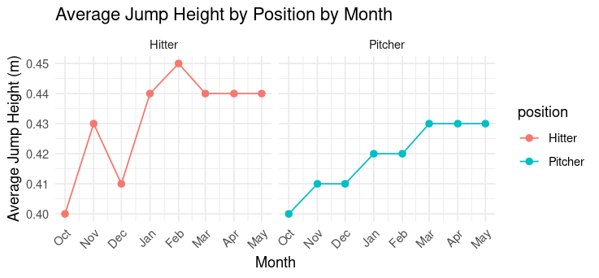
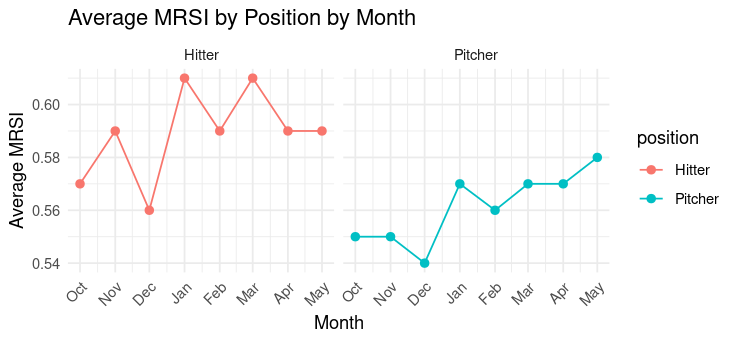

<h1 align="center">Matt Tometz, MS, CPSS, CSCS</h1>
<h2 align="center">Sport Science Portfolio</h2>

"Helping athletes and coaches take control of their sports story," that's why I'm here. As an ex-college baseball player and current Performance Coach/Sport Scientist, I'm extremely proud of the stories I've created. Now, how exciting of an opportunity is it to help everyone I interact with make their story worth telling.

Through combining the subjectivity of coaching, the objectivity of sport science, and the framework of the scientific method, 

---

# Research

[Master's Thesis Published in JSCR](https://journals.lww.com/nsca-jscr/fulltext/2022/08000/validation_of_internal_and_external_load_metrics.23.aspx)

- Title: Validation of Internal and External Load Metrics in NCAA D1 Women's Beach Volleyball

- Objective: Be the first study in women's college beach volleyball, and first validation study in all of beach volleyball, to validate sRPE Load and Distance covered to heart rate load (TRIMP)

---

## Data Analytics Projects
### 1080 Load-Velocity Profiling 👟
- **Objective:** take profiling data from the 1080 Sprint
- **Practical Applications:** help coaches more quickly and effective select loads for resisted sprint training for large groups and/or when the time to profile isn't available. As well, this will serve as benchmarks to evaluate individuals athletes compared to group averages.
- [Link to R Script](LVP_1080_r_script.R)
- [Link to Excel output](LVP_grou_averages.csv)

### Velocity-Based Training Squat Load-Power Profiling 💪
- **Objective:** take training data from a variety of squats including load, velocity, and power to calculate both the percent of estiamted 1-rep max and velocity for max power
- **Practical Applications:** help coaches give guidance for velocity training zones for Power Development blocks when the time to profile or prior training data isn't available. As well, this will serve as benchmarks to evaluate individuals athletes compared to group averages.
- [Link to R Script](Squat_Power_R_Script.R)
- [Link to Excel output](Squat_Power_Results.csv)
    
### Force Plate Visualizations 🐰
- **Objective:** visualize 2 different force plate metrics over time to give a quick snapshot of the team's performance by position group
- **Practical Applications:** help coaches retroactively active high and low periods of training, reflect on unavoidable/confounding variables like in-season travel, etc. to proactively prepare for the highs and lows throughout an academic calendar in the future
- [Link to R Script](Force_Plate_Viz_R_Script.R)
- [Link to Excel output](Force_Plate_Results_Table.csv)
- 
- 

---

## Relevant Skills and Exposures
### Performance Softwares/Technologies
- 1080 Sprint
- VALD NordBord
- Hawkins Dynamics Force Plates
- Gymwaware/Enode VBT
- VALD and Dashr Timing lasers
- R
- Microsoft Excel/Google Sheets
- ChatGPT

### Skills
- Intermediate Spanish communication 

## Resume and Certifications
- [Link to Resume PDF](MattTometzResume.pdf)
- [Certified Performance and Sport Scientist](Matt_Toemtz_NSCA_ID.pdf)
- [Certified Strength and Conditioning Specialist](Matt_Toemtz_NSCA_ID.pdf)
- [Google Data Analytics Professional Certificate](Matt_Tometz_Google_Data_Analytics_Certificate.pdf)

## Contact Information
- [matthew.tometz@gmail.com](matthew.tometz@gmail.com)
